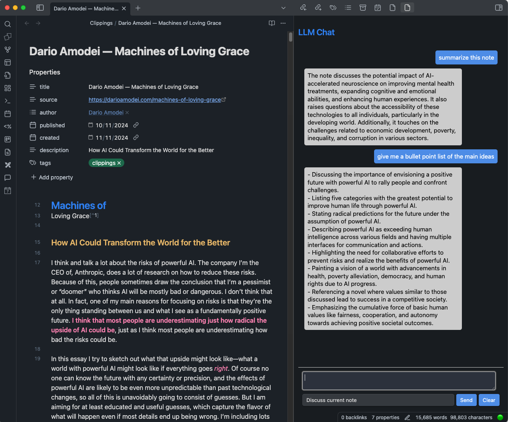

# AI Assistant for Obsidian (tech16-final-project)

## Overview

The goal of this project is to provide an AI assistant for Obsidian notes.

It consists of:

- HTTP server that acts as an LLM chatbot with access to an Obsidian vault
- Obsidian plugin that serves as the UI client
- CLI client for testing interaction with the server
- additional tools / scripts for automatic processing of notes 

Here is a screenshot of the Obsidian plugin interface:

{width=600px}

## Install

Setup Python virtual environment

```shell
python -m venv venv
source venv/bin/activate
```

Install dependencies

```shell
pip install -r requirements.txt
```
## Run

To start the server run
```shell
python server/server.py
```

To start the CLI client
```shell
python cli_client.py
```
